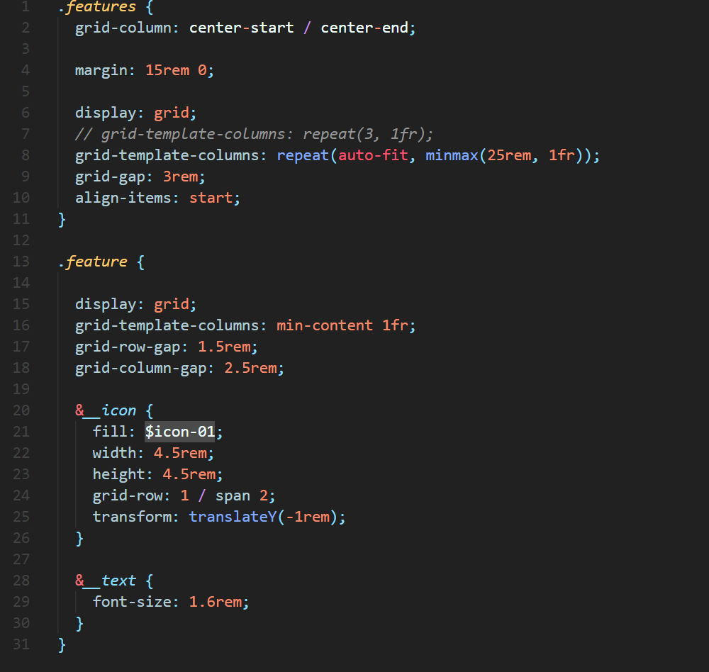
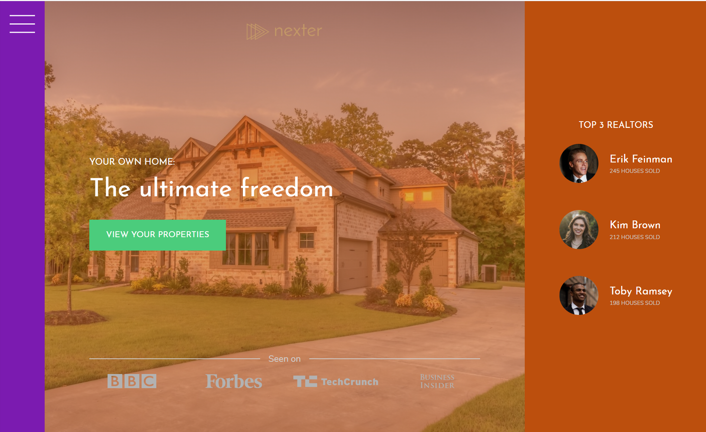
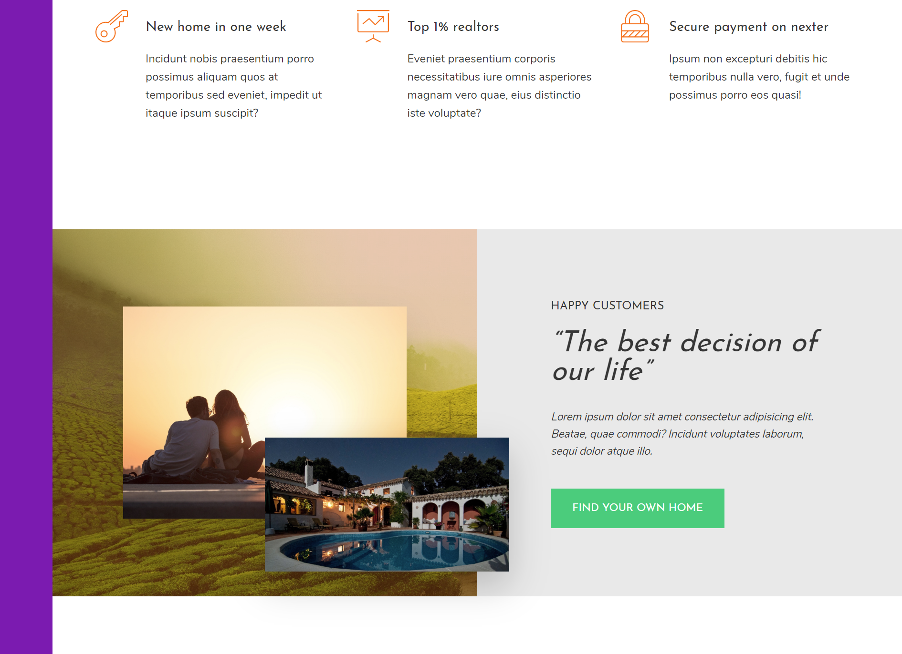
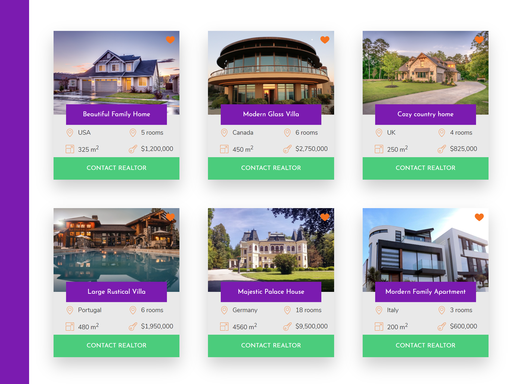
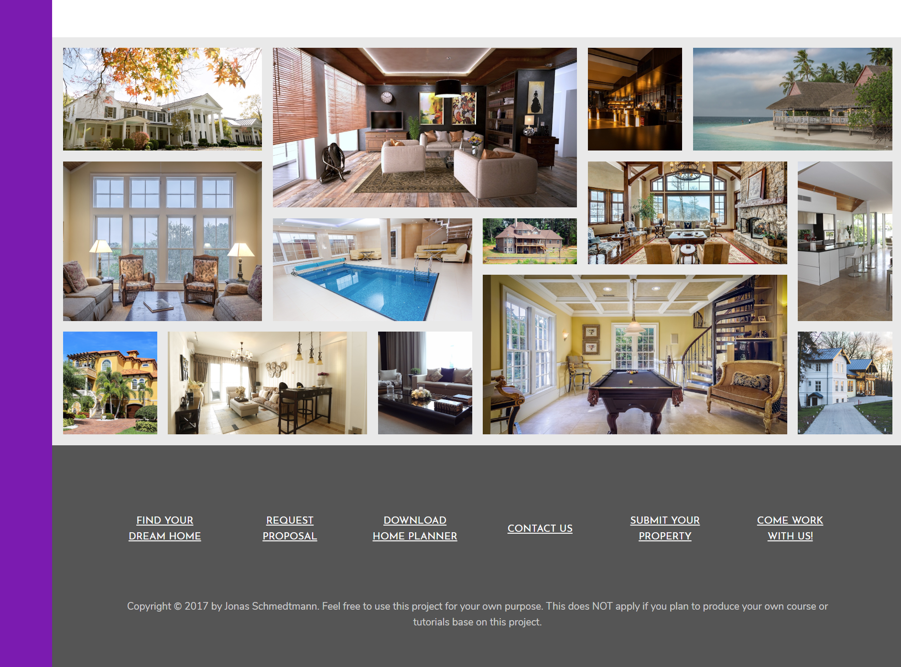

# NEXTER - CSS GRID LAYOUT PROJECT
A project to build a website for a frictional real-estate property company using full CSS Grid mobile responsiveness design.

## Credited Statement
This is one of my homework projects in the web frontend design and programing bootcamp, the design of the website and training material is from one of the best instructors in the business, in this homework assignment, I am the student and a programmer to perform all of the coding followed the teaching concepts tought in the course.

### Designer/Instructor/Programmer

Course Designer/Instructor/Developer: Jonas Schmedtmann

Student/Programmer: Chris Thanh Nguyen

### Note on project color theme
I have changed the color theme to practice some color design concepts, to see the original color scheme for this course, please visit [udemy.com](https://www.udemy.com/course/advanced-css-and-sass/learn/lecture/8859774#overview) for more information.

### What I can do after this training?
After finish the training course, I am able to understand all the concepts and now able to design and code very high quality and most beatifull web/app front and fill confident to produce many challenging realworld  frontend projects.

## View the page
[Click to run](https://monksedo.github.io/nexter/)

## Code Snippet
### The beauty power of CSS Grid code

### Sample on feature page Grid layout

## Screenshot 
### Home page

### Feature page

### Home Listing Page

### Image gallery page

